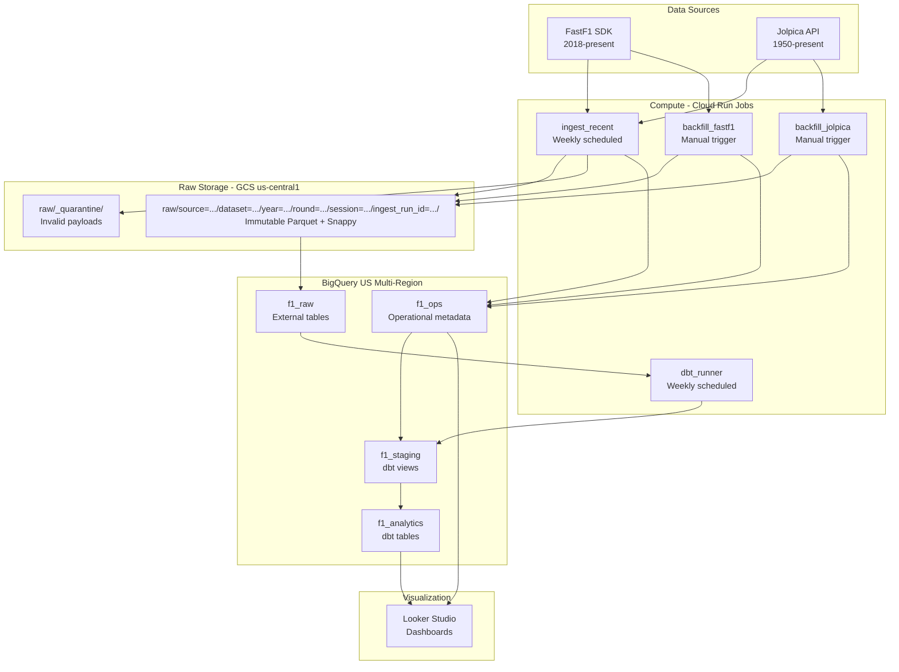

# Architecture

## System Overview



## Data Flow

1. **Ingestion**: Cloud Run Jobs fetch data from FastF1 SDK and Jolpica API
2. **Validation**: Schema contracts validate data before writing
3. **Storage**: Valid data written as immutable Parquet to GCS; invalid data quarantined
4. **Manifest**: Every write logged to `f1_ops` (ingest_runs, ingest_objects, latest_successful_objects)
5. **External Tables**: BigQuery reads raw Parquet via external tables in `f1_raw`
6. **Staging**: dbt views in `f1_staging` clean, normalize, and filter to latest successful objects
7. **Analytics**: dbt tables in `f1_analytics` provide dimensional models and aggregates
8. **Dashboards**: Looker Studio connects to `f1_analytics` and `f1_ops`

## GCS Path Structure

```
raw/source=fastf1/dataset=laps/year=2024/round=08/session=R/ingest_run_id=20260427T120000Z/part-000.parquet
raw/source=jolpica/dataset=results/year=2024/round=08/ingest_run_id=20260427T120000Z/part-000.parquet
raw/_quarantine/source=jolpica/dataset=results/year=2024/round=08/ingest_run_id=.../error.json
```

## Cloud Run Job Configuration

| Job | Timeout | Memory | Max Retries | Trigger |
|---|---|---|---|---|
| `ingest_recent` | 1800s | 1 GB | 1 | Weekly (Monday 8am UTC) |
| `backfill_jolpica` | 6h | 1 GB | 0 | Manual |
| `backfill_fastf1` | 6h | 1 GB | 0 | Manual |
| `dbt_runner` | 3600s | 2 GB | 1 | Weekly (Monday 9am UTC) |

## IAM Design

| Service Account | Purpose | Key Roles |
|---|---|---|
| `sa-f1-ingest` | Ingestion jobs | Storage Object Creator, BQ Data Editor, BQ Job User |
| `sa-f1-dbt` | dbt runner | BQ Data Editor, BQ Job User, Storage Object Viewer |
| `sa-f1-scheduler` | Cloud Scheduler | Cloud Run Invoker |

No JSON keys. GitHub Actions authenticate via Workload Identity Federation.

## Location Strategy

| Resource | Location | Reason |
|---|---|---|
| GCS buckets | `us-central1` regional | GCS free tier eligible, compatible with BQ US external tables |
| BigQuery datasets | `US` multi-region | Free tier eligible, compatible with external tables |
| Cloud Run Jobs | `us-central1` | Colocated with GCS |
| Artifact Registry | `us-central1` | Colocated with Cloud Run |
